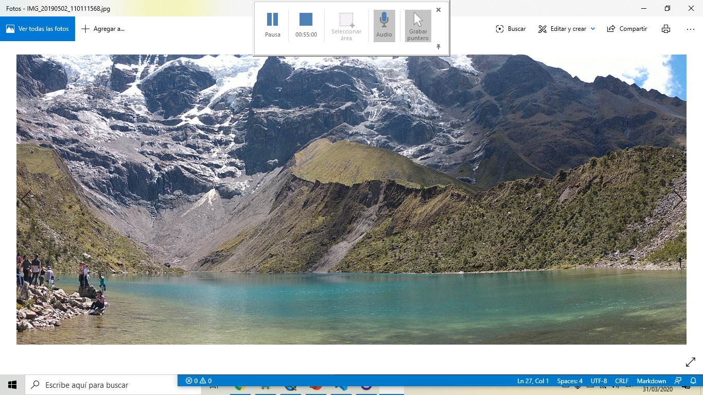

# Ejercicio_1
Hola

#CARTOGRAFIA_1

##EJEMPLO_1 

Alt-ESCALA
======

##lista_1

1. Manzana
2. Pera
3. Piña
4.**mango**
5. **papaya**

##Propiedades de frutas importantes

[https://exoticfruitbox.com/frutas-exoticas/mango/]

##PAISAJE_PANTALLAZO

##Lista Paisaje

1. **Piedra**
2. **Laguna**

